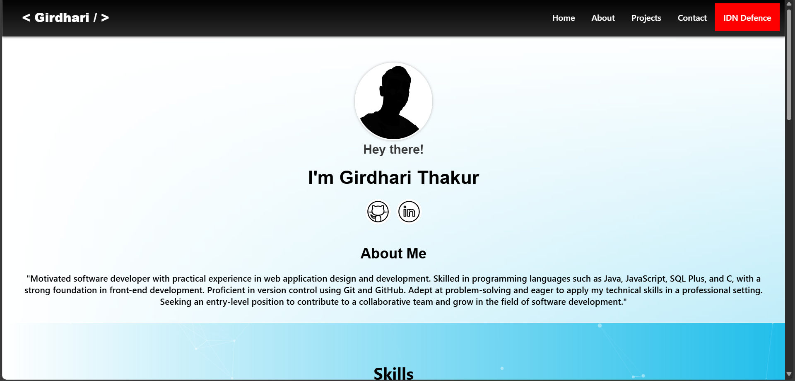
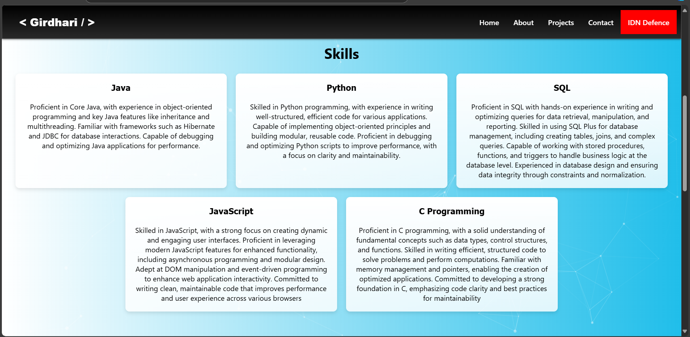
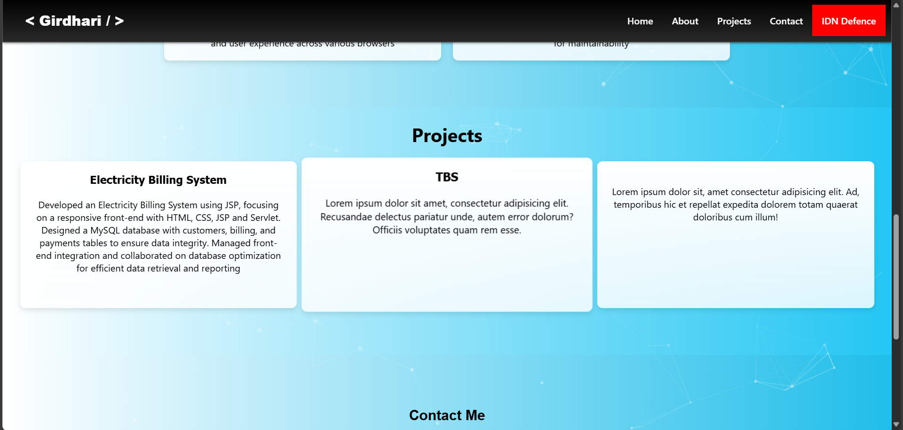
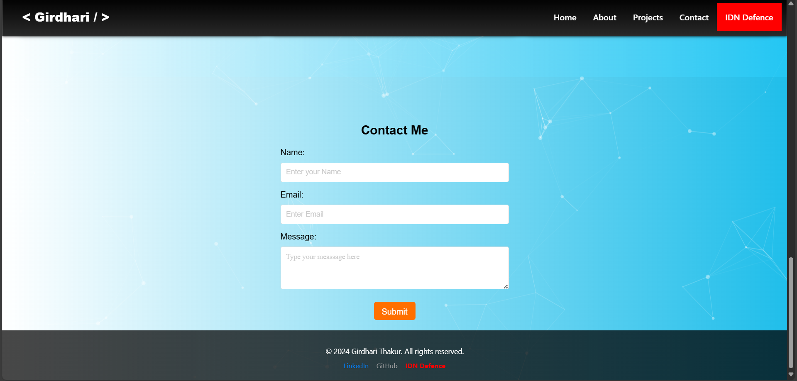

# My Personal Portfolio Website

👁️👁️This repo is will not recieve update

🕸️     Visit Live Site Link : [girdharithakur.in](https://girdharithakur.in "visit")


This is the source code for my personal portfolio website. It showcases my projects, skills, and ways to contact me. The site is built using **HTML**, **CSS**, and **JavaScript**, and includes external libraries for particle effects and form handling.

## Features

- **Responsive Design**: The website adjusts for different screen sizes.
- **Particle Animation**: Interactive particle effects using the `particles.js` library.
- **Dynamic Navigation**: Hamburger menu for easy navigation on smaller screens.
- **Custom Alert**: Notifies users that the site is under construction.
- **Skills Section**: Highlights my expertise in various programming languages and tools.
- **Projects Section**: Showcases key projects like the Electricity Billing System.
- **Contact Form**: A simple form to allow visitors to contact me.
- **Social Media Links**: Links to GitHub, LinkedIn, and Twitter profiles.
- **Footer Section**: Contains social media links and copyright information.

## Technologies Used

- **HTML5**: For structuring the content.
- **CSS3**: For styling and responsive design.
- **JavaScript**: For interactivity and custom scripts.
- **particles.js & tsparticles**: For creating particle effects.
- **Netlify Forms**: For handling contact form submissions.

## Project Structure

```
├── index.html              # Main HTML file
├── style.css               # Main CSS file for styling
├── script.js               # JavaScript file for interactivity
├── data/
│   ├── icons/              # Directory for favicon and social media icons
│   ├── logo/               # Directory for profile pictures
│   └── pages/              # Additional pages (About, Projects, Contact)
```

## Installation

To run this project locally:

1. Clone the repository:

   ```bash
   git clone https://github.com/girdharikrthakur/portfolio.git
   ```
2. Navigate to the project directory:

   ```bash
   cd portfolio
   ```
3. Open the `index.html` file in a browser to view the site:

```bash
   open index.html
```

## Preview









## Usage

- The site contains sections for "About Me," skills, projects, and a contact form.
- Visitors can navigate the site through the navbar and explore various sections.
- The contact form uses Netlify for submissions and will display alerts for under-construction features.

## License

This project is licensed under the [MIT License](LICENSE)
